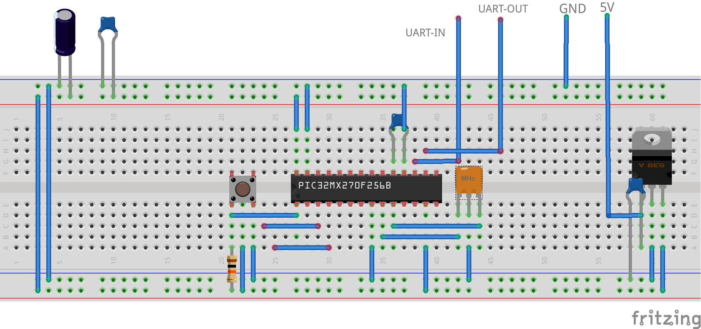

# KOZOS-PIC
## ソースコード整理中
　学習用組込みOS「[KOZOS](http://kozos.jp/kozos/)」の書籍版「[12ステップで作る 組込みOS自作入門](https://www.amazon.co.jp/gp/product/4877832394/)」をPIC(MIPS)に移植したものです。
ターゲットはPIC32MX270F256Bを想定しています。

## ブレッドボード図

※気が向いたら見やすいように書き直します